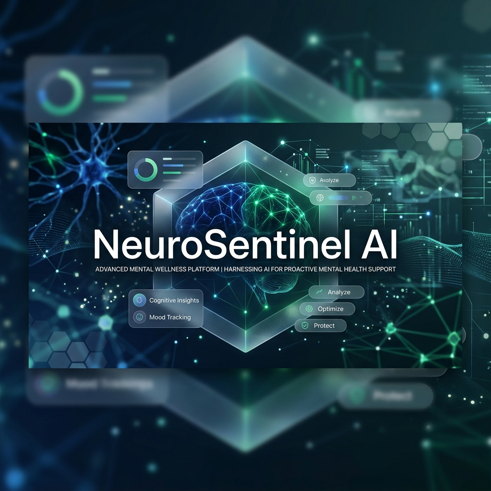
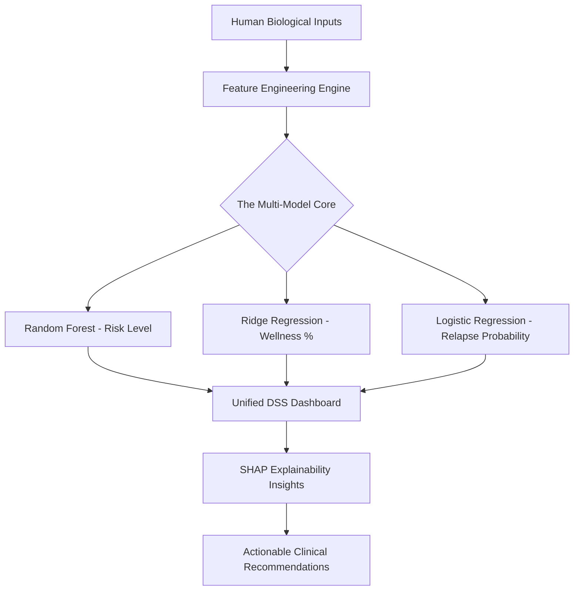

<p align="center">
  
</p>

# 🧠 NeuroSentinel: AI-Driven Mental Health Decision Support System 

<p align="center">
  
  
  
  
  
</p>

**NeuroSentinel** is a research-grade, enterprise-ready **Decision Support System (DSS)**. It leverages advanced machine learning to analyze human biological markers in real-time, providing deep insights into mental health stability and wellness trajectories.

---

## ✨ The Vision: AI-Assisted Clinical Wellness
Mental health management often lacks granular, data-driven markers. NeuroSentinel bridges this gap by synchronizing 7-vector biological telemetry into a unified stability score, allowing for:
- 🚀 **Early Intervention**: Predicting risk spikes *before* they manifest as clinical crises.
- 📉 **Longitudinal Tracking**: Visualizing the "mood-stress" correlation over 14-day windows.
- 💡 **Actionable Prescriptions**: Automatically suggesting lifestyle shifts (e.g., "Enforce 7.5h sleep") based on wellness volatility.

---

## 🛠️ Advanced "Multi-Brain" AI Core
NeuroSentinel doesn't just "guess." It uses a specialized trio of models to provide a holistic view of user health:

### 🧩 1. The Risk Classifier (Random Forest)
- **Algorithm**: Tuned ensemble with 200 trees via `GridSearchCV`.
- **Function**: Categorizes state into *Mild, Moderate,* or *Severe* with confidence probabilities.

### 📈 2. The Wellness Regressor (Ridge)
- **Algorithm**: Ridge Regression for continuous severity indexing.
- **Function**: Assigns a granular weight to wellness stability (0-100%).

### 📉 3. The Relapse Engine (Logistic Regression)
- **Algorithm**: Logistic Regression on longitudinal delta features.
- **Function**: Calculates the % probability of risk-level worsening within the next 48 hours.

---

## 📊 Visualizing the Architecture


---

## 🎨 Professional Analytics & UX
Organized into three professional work-tabs, our dashboard is designed for high-stakes decision-making:

- **🏠 Overview Tab**: Real-time health cards, baseline Radar comparisons, and historical distributions.
- **📈 Trend Tab**: Detailed mood-vs-stress line charts to uncover hidden lifestyle correlations.
- **⚡ Predictive DSS Tab**: The "Trajectory Engine" – forecasting future wellness states with AI confidence.

---

## 🏁 Automated Ignition
NeutroSentinel is designed for seamless deployment. Run the automated startup script from the root directory:

```powershell
.\start_system.ps1
```
*This launches the Python REST API (Flask) and the Next.js frontend concurrently with unified dependency resolution.*

---

## 📂 Project Intelligence Root
- `/frontend`: Next.js dashboard application with professional DSS telemetry.
- `/backend`: Flask AI server, ML pipeline, and SHAP explainability service.
- **[algorithm_mapping.md](algorithm_mapping.md)**: Deep technical map of applied ML strategies.
- **[train_model_explanation.md](train_model_explanation.md)**: Breakdown of the 1,500-sample training logic.

---

## ⚖️ Clinical Disclaimer & License
> [!IMPORTANT]
> NeuroSentinel is a **Decision Support System (DSS)** and is NOT intended as a standalone diagnostic tool. 
> All AI-generated results should be reviewed by a qualified mental health professional.

This project is licensed under the MIT License.
